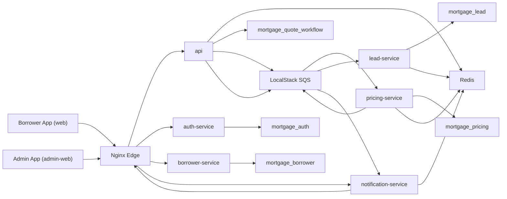

# Harbor Loan Quotes

Mortgage quote and lead-generation platform with a borrower-facing React app, a separate admin app, an edge Nginx proxy, and Spring Boot microservices.

Additional docs:
- [Architecture diagrams](./docs/architecture.md)
- [Operations runbook](./docs/ops-runbook.md)

## Runtime Overview
- `web`: borrower-facing React + Vite app served by Nginx
- `admin-web`: admin React + Vite app served by Nginx at `/admin/`
- `edge`: public Nginx reverse proxy on `8088` and `8443`
- `api`: public quote orchestration, calculators, metrics aggregation, notification publishing
- `auth-service`: registration, login, and internal JWT issuance
- `borrower-service`: borrower ownership and borrower metrics
- `pricing-service`: asynchronous pricing engine with a persisted pricing catalog
- `lead-service`: asynchronous lead creation and lead metrics
- `notification-service`: quote snapshot delivery and SSE notifications
- `mysql`: relational persistence
- `redis`: session state, dedupe state, cache support, metrics counters, notification snapshots
- `localstack`: local SQS emulation

## Architecture


## What The System Does
1. Anonymous user requests a public mortgage quote.
2. `api` deduplicates repeated requests per session and persists quote state.
3. `api` publishes a pricing job to SQS.
4. `pricing-service` prices the scenario from its own persisted product catalog and publishes a result event.
5. `api` consumes the pricing result and updates the quote read model.
6. If the quote is refined by an authenticated user, `lead-service` creates a lead asynchronously and publishes a lead result event.
7. `notification-service` stores the latest quote snapshot and serves SSE updates to the frontend.
8. `admin-web` reads aggregated metrics through `api`.

## Service Boundaries

### `api`
Owns:
- public quote creation and retrieval
- quote refinement orchestration
- quote read model in `mortgage_quote_workflow`
- monthly payment and amortization calculators
- session-aware deduplication
- quote metrics and admin summary aggregation
- notification snapshot publishing
- service-to-service JWT issuance for workers and internal clients

### `auth-service`
Owns:
- user registration
- user login
- access token issuance
- internal JWT authentication mode

### `borrower-service`
Owns:
- borrower creation and retrieval
- borrower existence checks for downstream services
- borrower metrics
- borrower persistence in `mortgage_borrower`

### `pricing-service`
Owns:
- pricing job consumption
- pricing catalog persistence in `mortgage_pricing`
- pricing products, rate sheets, and adjustment rules
- Redis pricing cache
- pricing metrics
- lead job publishing

### `lead-service`
Owns:
- lead creation from completed refined quotes
- lead persistence in `mortgage_lead`
- lead metrics

### `notification-service`
Owns:
- quote notification event consumption
- latest quote snapshot cache in Redis
- quote snapshot fetch endpoint
- quote SSE endpoint used by the frontend

## Database Ownership
- `auth-service` -> `mortgage_auth`
- `borrower-service` -> `mortgage_borrower`
- `api` -> `mortgage_quote_workflow`
- `pricing-service` -> `mortgage_pricing`
- `lead-service` -> `mortgage_lead`
- `notification-service` -> Redis only

Each service owns its own database schema — no cross-service table access.

## Messaging Topology
Queues created in LocalStack SQS:
- `quote-pricing-requests`
- `quote-pricing-results`
- `quote-lead-requests`
- `quote-lead-results`
- `quote-notification-events`
- `quote-pricing-results-dlq`
- `quote-lead-results-dlq`
- `quote-notification-events-dlq`

### Message contract hardening
All asynchronous message payloads include:
- `schemaVersion`
- `messageId`

Consumers:
- reject unsupported schema versions
- dedupe deliveries on `messageId`
- publish poison messages to DLQs when processing fails

## Security Model

### User authentication
Two modes are supported for protected user-facing endpoints in `api` and `borrower-service`:
- `internal`: built-in `auth-service` issues HMAC-signed JWTs
- `oidc`: local Keycloak issues OIDC access tokens validated from a configured JWK set URI

Required OIDC settings:
- `APP_USER_TOKEN_PROVIDER=oidc`
- `APP_USER_TOKEN_ISSUER=http://keycloak:8080/realms/mortgage-loan-api`
- `APP_USER_TOKEN_AUDIENCE=mortgage-loan-api-web`
- `APP_USER_TOKEN_JWK_SET_URI=http://keycloak:8080/realms/mortgage-loan-api/protocol/openid-connect/certs`

### Service-to-service authentication
Internal services use service JWTs with issuer, audience, scope, and type validation.

Examples:
- `api` -> `borrower-service`
- `api` -> `pricing-service` via job token
- `pricing-service` -> `lead-service` via job token
- `api` -> `notification-service` via job token

## Session Tracking And Deduplication
The borrower-facing frontend generates and persists a session ID and sends it on quote requests with `X-Session-Id`.

`api` uses Redis to:
- track active sessions
- detect in-flight duplicate quote requests
- return the existing `quoteId` when a duplicate request is already `QUEUED` or `PROCESSING`
- maintain fast quote status snapshots for the async flow

## Metrics And Admin Surface

### Borrower-facing app
The public app is borrower-first and intentionally hides internal platform views.
It focuses on:
- guided public quote request
- borrower quote refinement after sign-in
- my quotes history
- public calculators
- lender and agent match directory

### Admin app
The separate admin app at `/admin/` displays:
- borrower totals and credit-score distribution
- quote funnel and quote outcomes
- pricing product distribution
- lead status distribution
- system snapshot metrics
- lender and agent directory management

### Admin summary endpoint
- `GET /api/metrics/admin/summary`

Admin access requires an `ADMIN` role token.

This endpoint aggregates:
- quote metrics from `api`
- borrower metrics from `borrower-service`
- pricing catalog metrics from `pricing-service`
- lead metrics from `lead-service`

## Local Run Modes

### Lightweight local stack
Use this when you only need the borrower-facing app, auth, borrower APIs, MySQL, Redis, and edge routing.

```bash
docker compose up -d --build
```

### Full integration demo stack
Use this when you need async pricing, lead generation, notifications, admin-web, and LocalStack queues.

```bash
docker compose --env-file .env.integration --profile integration up -d --build
```

Or:
```bash
make up
```

Stop the stack:

```bash
docker compose --env-file .env.integration --profile integration down
```

Or:
```bash
make down
```

### Why the integration env file exists
[.env.integration](./.env.integration) forces the async quote flow on for local demo and CI runs so `api` publishes pricing jobs consistently.

## Testing

### Backend tests
```bash
mvn -Dmaven.repo.local=.m2 test
cd auth-service && mvn test
cd borrower-service && mvn test
cd pricing-service && mvn test
cd lead-service && mvn test
cd notification-service && mvn test
```

### Frontend unit tests
```bash
cd web && npm run test:ci
cd admin-web && npm run test:ci
```

### Browser end-to-end tests
The Playwright suite lives in [e2e](./e2e).

Install once:
```bash
cd e2e
npm install
npx playwright install chromium
```

Run against the full integration stack:
```bash
docker compose --env-file .env.integration --profile integration up -d --build
cd e2e
npm run test
cd ..
docker compose --env-file .env.integration --profile integration down
```

### Local smoke check
Use the checked-in smoke runner after the integration stack is up:

```bash
./scripts/local-smoke.sh
```

Or:
```bash
make smoke
```

What it verifies:
- borrower quote flow
- borrower auth redirect before personalization
- admin login
- admin workspace access

### Make targets
```bash
make up
make smoke
make e2e
make down
```

Covered flows:
- borrower public quote request
- borrower auth redirect before personalization
- direct admin login
- admin workspace access

## CI
[Jenkinsfile](./Jenkinsfile) runs:
- JUnit suites for all Java services
- frontend unit tests for `web` and `admin-web`
- frontend production builds
- Playwright E2E tests on the integration-profile Docker stack

## Frontend Apps

### Borrower app
Source:
- `web/`

Focus:
- public quote flow
- refined quote flow
- my quotes history
- calculators
- lender and agent match directory
- login/register
- quote status updates through notification SSE or polling fallback

### Admin app
Source:
- `admin-web/`

Focus:
- operational visibility
- borrower, quote, lead, and pricing metrics
- lender and agent directory management

## Java Namespace
All Java services use:

```text
com.jaycodesx.mortgage
```

The default scaffold namespace was removed.

## Directory Structure

### Root API
```text
src/main/java/com/jaycodesx/mortgage
├─ MortgageApplication.java
├─ borrower
│  ├─ controller
│  ├─ dto
│  ├─ model
│  ├─ repository
│  └─ service
├─ infrastructure
│  ├─ admin
│  ├─ borrower
│  ├─ config
│  ├─ messaging
│  ├─ metrics
│  └─ security
├─ lead
│  ├─ dto
│  ├─ model
│  └─ repository
├─ pricing
│  └─ service
├─ quote
│  ├─ controller
│  ├─ dto
│  ├─ model
│  ├─ repository
│  └─ service
└─ shared
   ├─ controller
   ├─ dto
   ├─ model
   ├─ repository
   └─ service
```

### `auth-service`
```text
auth-service/src/main/java/com/jaycodesx/mortgage
├─ AuthServiceApplication.java
├─ auth
│  ├─ controller
│  ├─ dto
│  ├─ model
│  ├─ repository
│  └─ service
└─ infrastructure
   └─ security
```

### `borrower-service`
```text
borrower-service/src/main/java/com/jaycodesx/mortgage
├─ BorrowerServiceApplication.java
├─ borrower
│  ├─ controller
│  ├─ dto
│  ├─ model
│  ├─ repository
│  └─ service
└─ infrastructure
   ├─ config
   ├─ metrics
   └─ security
```

### `pricing-service`
```text
pricing-service/src/main/java/com/jaycodesx/mortgage
├─ PricingServiceApplication.java
├─ infrastructure
│  ├─ config
│  ├─ messaging
│  ├─ metrics
│  └─ security
├─ lead
│  ├─ model
│  ├─ repository
│  └─ service
├─ pricing
│  ├─ model
│  ├─ repository
│  └─ service
├─ quote
│  ├─ dto
│  ├─ model
│  ├─ repository
│  └─ service
└─ shared
   └─ service
```

### `lead-service`
```text
lead-service/src/main/java/com/jaycodesx/mortgage
├─ LeadServiceApplication.java
├─ infrastructure
│  ├─ messaging
│  ├─ metrics
│  └─ security
├─ lead
│  ├─ model
│  ├─ repository
│  └─ service
└─ quote
   ├─ model
   └─ repository
```

### `notification-service`
```text
notification-service/src/main/java/com/jaycodesx/mortgage
├─ NotificationServiceApplication.java
├─ infrastructure
│  ├─ messaging
│  └─ security
├─ lead
│  └─ dto
├─ notification
│  ├─ controller
│  ├─ dto
│  └─ service
```

### `admin-web`
```text
admin-web
├─ src
├─ public
├─ Dockerfile
├─ nginx.conf
└─ package.json
```

## Primary API Endpoints

### Public quote and quote lifecycle
- `POST /api/loan-quotes/public`
- `GET /api/loan-quotes/{id}`
- `POST /api/loan-quotes/{id}/refine`
- `GET /api/loan-quotes/{id}/events`

### Free calculators
- `GET /api/loans/mortgage-payment/calculate`
- `GET /api/loans/amortization/calculate`

### Auth
- `POST /api/auth/register`
- `POST /api/auth/login`
- `POST /api/auth/refresh`

### Borrowers
- `POST /api/borrowers`
- `GET /api/borrowers/{id}`

### Notifications
- `GET /api/notifications/quotes/{id}`
- `GET /api/notifications/quotes/{id}/events`

### Borrower quote history
- `GET /api/borrower/quotes`

### Directory
- `GET /api/directory/locations`
- `GET /api/directory/agents`
- `GET /api/directory/lenders`

### Admin directory management
- `GET /admin/agents`
- `GET /admin/lenders`

### Metrics
- `GET /api/metrics/quotes`
- `GET /api/metrics/admin/summary`
- `POST /api/metrics/quotes/sessions/authenticated`

## Local Development

### Start the full stack
```bash
docker compose up -d --build
```

### Start only what you need
Example auth and quote verification stack:
```bash
docker compose up -d --build mysql redis localstack api auth-service borrower-service pricing-service lead-service notification-service web admin-web edge
```

### Start the optional OIDC profile with Keycloak
```bash
APP_USER_TOKEN_PROVIDER=oidc \
APP_USER_TOKEN_ISSUER=http://keycloak:8080/realms/mortgage-loan-api \
APP_USER_TOKEN_AUDIENCE=mortgage-loan-api-web \
APP_USER_TOKEN_JWK_SET_URI=http://keycloak:8080/realms/mortgage-loan-api/protocol/openid-connect/certs \
docker compose --profile oidc up -d --build keycloak mysql redis localstack api borrower-service web admin-web edge
```

Local Keycloak URLs:
- issuer: `http://localhost:18080/realms/mortgage-loan-api`
- admin console: `http://localhost:18080/admin`

Imported demo credentials:
- Keycloak console: `admin` / `admin`
- admin user: `admin@example.com` / `StrongPass123!`
- test user: `testuser` / `StrongPass123!`

### Stop everything
```bash
docker compose down
```

### Local URLs
- borrower app: `http://localhost:8088`
- borrower app (TLS): `https://localhost:8443`
- admin app (TLS): `https://localhost:8443/admin/`
- health: `https://localhost:8443/actuator/health`

If local TLS certs are missing:
```bash
./scripts/generate-local-certs.sh
```

## Build And Test

### Backend tests
```bash
mvn -Dmaven.repo.local=.m2 test
```

### Borrower app
```bash
cd ./web
npm install
npm run build
```

### Admin app
```bash
cd ./admin-web
npm install
npm run build
```

## Operations And Replay

Inspect DLQs:
```bash
./scripts/dlq-inspect.sh quote-pricing-results-dlq
./scripts/dlq-inspect.sh quote-lead-results-dlq
./scripts/dlq-inspect.sh quote-notification-events-dlq
```

Replay DLQ messages:
```bash
./scripts/dlq-replay.sh quote-pricing-results-dlq quote-pricing-results
./scripts/dlq-replay.sh quote-lead-results-dlq quote-lead-results
./scripts/dlq-replay.sh quote-notification-events-dlq quote-notification-events
```

For a fuller operator workflow, see:
- [Operations runbook](./docs/ops-runbook.md)
