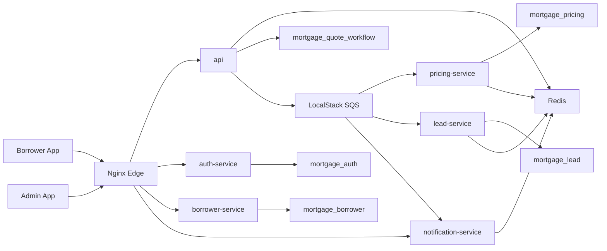
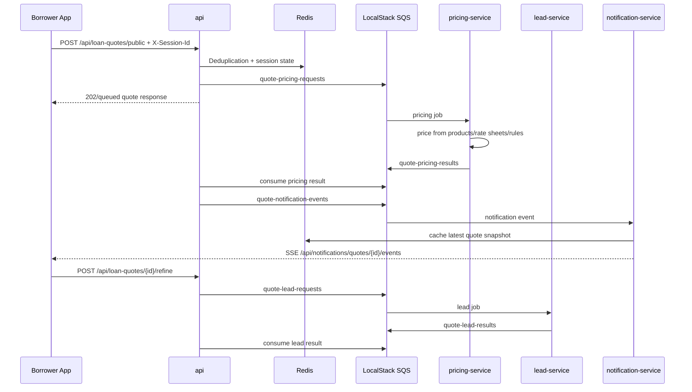
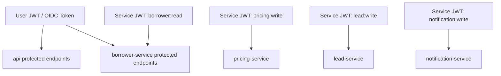

# Architecture Diagrams

## Service Topology

```mermaid
flowchart LR
    WEB["Borrower App"] --> EDGE["Nginx Edge"]
    ADMIN["Admin App"] --> EDGE
    EDGE --> API["api"]
    EDGE --> AUTH["auth-service"]
    EDGE --> BORR["borrower-service"]
    EDGE --> NOTIFY["notification-service"]
    API --> REDIS["Redis"]
    API --> DBQ["mortgage_quote_workflow"]
    API --> SQS["LocalStack SQS"]
    AUTH --> DBA["mortgage_auth"]
    BORR --> DBB["mortgage_borrower"]
    SQS --> PRICING["pricing-service"]
    PRICING --> DBP["mortgage_pricing"]
    PRICING --> REDIS
    SQS --> LEAD["lead-service"]
    LEAD --> DBL["mortgage_lead"]
    LEAD --> REDIS
    SQS --> NOTIFY
    NOTIFY --> REDIS
```

## Async Quote Flow

```mermaid
sequenceDiagram
    participant U as Borrower App
    participant A as api
    participant R as Redis
    participant Q as LocalStack SQS
    participant P as pricing-service
    participant L as lead-service
    participant N as notification-service

    U->>A: POST /api/loan-quotes/public + X-Session-Id
    A->>R: Deduplication + session state
    A->>Q: quote-pricing-requests
    A-->>U: 202/queued quote response
    Q->>P: pricing job
    P->>P: price from products/rate sheets/rules
    P->>Q: quote-pricing-results
    A->>Q: consume pricing result
    A->>Q: quote-notification-events
    Q->>N: notification event
    N->>R: cache latest quote snapshot
    N-->>U: SSE /api/notifications/quotes/{id}/events
    U->>A: POST /api/loan-quotes/{id}/refine
    A->>Q: quote-lead-requests
    Q->>L: lead job
    L->>Q: quote-lead-results
    A->>Q: consume lead result
```

## Security Boundaries

```mermaid
flowchart TD
    USERJWT["User JWT / OIDC Token"] --> API["api protected endpoints"]
    USERJWT --> BORR["borrower-service protected endpoints"]
    SVCJWT1["Service JWT: borrower:read"] --> BORR
    SVCJWT2["Service JWT: pricing:write"] --> PRICING["pricing-service"]
    SVCJWT3["Service JWT: lead:write"] --> LEAD["lead-service"]
    SVCJWT4["Service JWT: notification:write"] --> NOTIFY["notification-service"]
```
